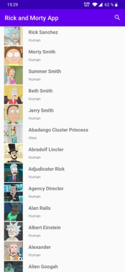
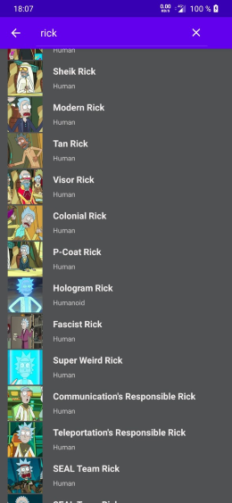
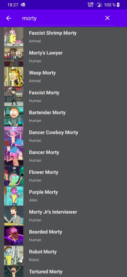
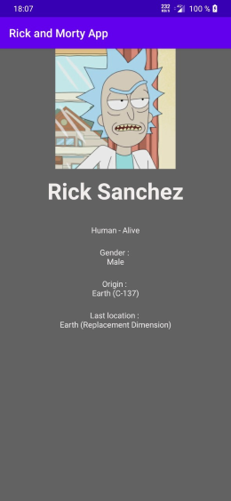
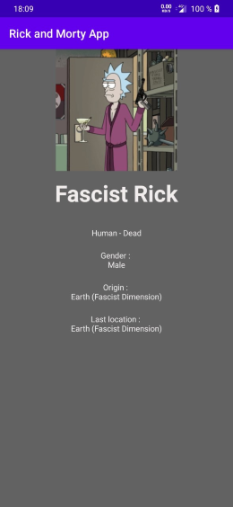
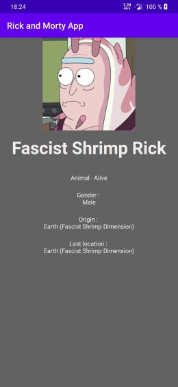

# Rick & Morty App

### Par Sofiane SERKESTI


## Présentation

Projet d'application mobile codée en Java.
Elle affiche la liste des personnages de la série "Rick & Morty" à partir de l'api :
````
https://rickandmortyapi.com/
````

## Consignes respectés :
- Affichage d'un RecyclerView
- Affichage détail élément
- Singleton
- Design Patern
- MVC
- Principe SOLID
- Fonctionnalité supplémentaire :
	- Récupération de tout les personnages de L'API (toutes les pages)
	- SearchView avec filtrage des données
	- Images personnages
	- Image application


## Fonctionnalités :

### Menu Home
- Affiche la liste des différents personnages
- Icone de recherche en haut à droite, pour filtrer la liste.

    

### Ecran de détail
- Affiche les caractéristiques du personnage :
	- Son nom et prénom
	- Son espèce (Humaine, Alien, etc...) suivi de son statut (Mort, En vie, etc...)
	- Son genre (Male, Femelle, etc...)
	- Sa planète d'origine (Terre, etc...)
	- Sa dernière localisation connue

     
